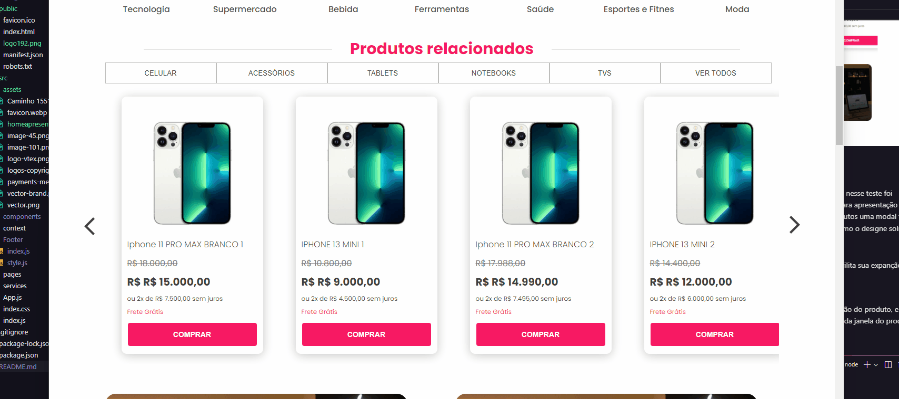
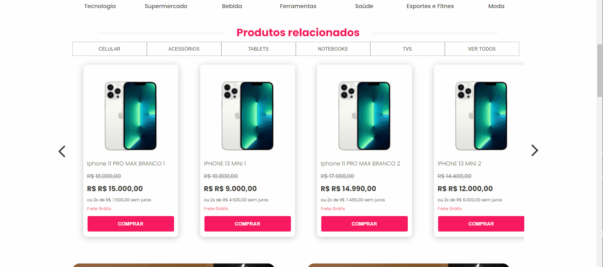

# Teste Técnico Econverse - Front-End Jr

## Deploy da Aplicação:

> Link do deploy da aplicação: https://reactjs-teste-econverse-frontend.vercel.app/

### Tópicos 

* [Sobre](#Sobre)

* [Funcionalidades](#funcionalidades)

* [Funcionalidades futuras](#funcionalidades-futuras)

* [Desenvolvido por:](#desenvolvido-por)

## Sobre:
Projeto desenvolvido em <b>ReactJS</b> para realização do teste técnico da agência Econverse, nesse teste foi solicitado a apresentação de uma página Home de e-commerce com consumo de API para apresentação dos produtos, fornecida pela mesma, também foi solicitado que ao clicar nos cards dos produtos uma modal fosse aberta com detalhes do pruduto clicado. As solicitações foram todas atendidas assim como o designe solicitado.

## Funcionalidades:
O projeto foi realizao em componentes individualizados, separados por seções o que facilita sua expanção como a sua manutenção.

### Modal

Ao clicar nos cards dos produtos presentes no carrosel ele abre um modal com a descrição do produto, e o mesmo pode ser fechado cliclando no botão "X" no canto superior direito, clicando fora da janela do produta ou pressionando a telca "ESC".

 
 

### Carrosel 

Componente alimentado por componente de card de produto que por sua vez está ligado direto a API deixando-o assim sempre atualizado.

 
 

### MenuResponsivo

Menu responsivo para dispositivos mobiles.

 
 

### Botões com estilização Condicional

Todos os botões contam com estilização condicional através de styled-components,
outros eles da pagina também possuem renderização condição.

## Funcionalidades Futuras:

O projeto foi estruturado para que seja facilmente implantadas outras páginas através do <b>react-router-dom</b>, podendo continuar utilizando o <b>context-api</b> ou dependendo da complexidade do projeto ser aplicado o <b>Redux</b>.

## Desenvolvido por:

| [ Bruno Lima](https://github.com/bruno-lima1504) 
| :---: |

